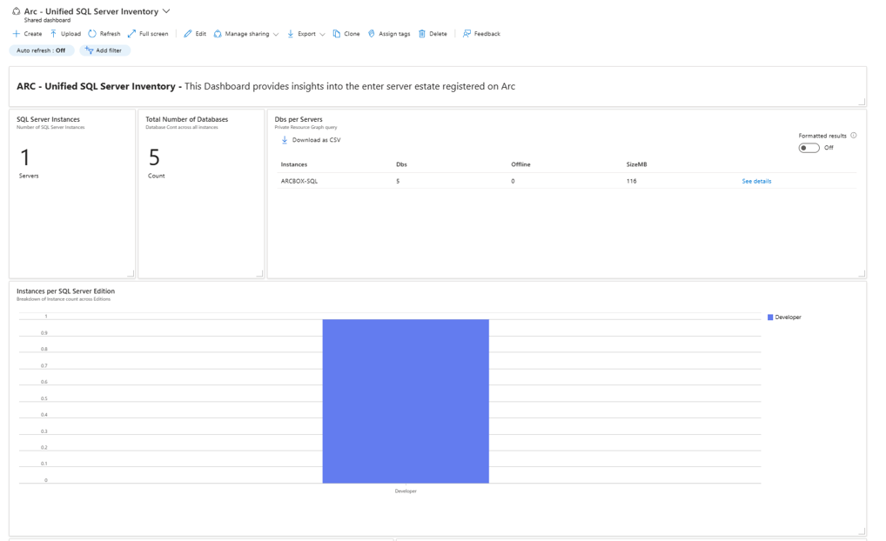
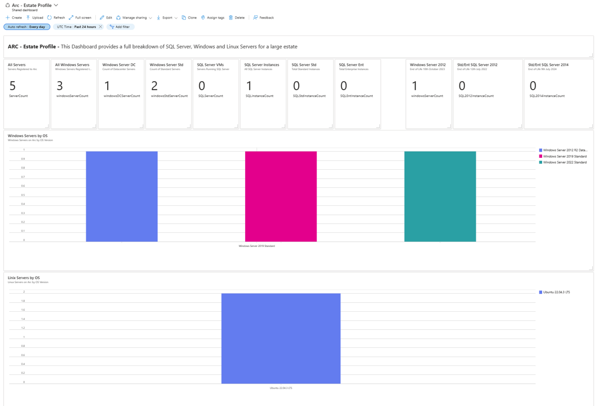
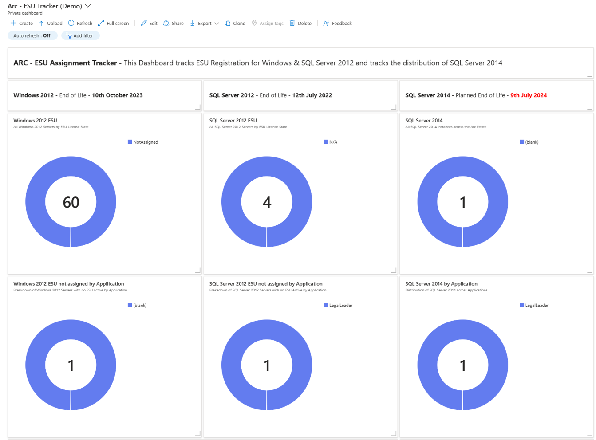
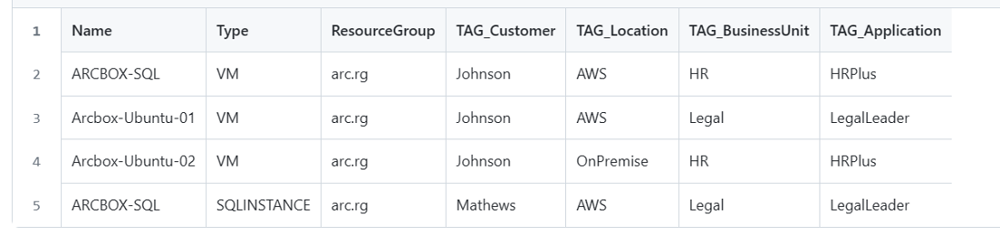

# Arc-Azure-Portal-Dashboards
This is a collection of Arc Dashboards & Scripts designed to leverage the Azure Resource Graph metadata captured as part of an Arc roll out.  These Azure Dashboards can be deployed as JSON files to your Azure Tenant and can be saved a private or publicly shared resources.

This will be an evolving set of Dashboards and resources all designed to provide a summary "one stop shop" view of Azure Arc connected VMs and Arc enabled SQL Servers.  Please note some of these dashboards use custom tagging to track distribution of Arc resources - the section at the end of this readme walks through some of the scripts included on this Repo that help with bulk application of Tags to VMs and SQL Instances.

# Installing the Dashboards
Each Dashboard is simply a JSON file.  The simplest way to install the dashboard is to download one from the "Dashboards" folder, go to the Azure Portal, select "Dashboards", open any existing Dashboard (or create a new one) and select "Upload".  You can then select the respective JSON file and it wil be installed.

**Please note** however that it will by default be created as a "Private" Dashboard meaning only you will be able to see it.  To make it available to your colleagues you can hit the "Share" button which will publish it to a shared dashboard area or a named resource group. 

Current dashboards on the repo include:

## ARC - Rollout Progress Tracker

(Note: may take some time to run on large Arc enabled estates)
Collects together a number of metrics and views to track Arc rollout progess and to pick up on any gaps that may exist, for example the number of VMs where SQL Server has been discovered vs the number of VMs that actually have the SQL Server Arc Agent installed.  Final Tiles provide detail queries for all Servers and all SQL Server instances, these can be downloaded as CSVs for further analysis


## ARC - Unified Server Inventory

Displays a full inventory of all Servers (Windows & Linux) registered to Arc.  Includes breakdowns by OS, OS Type (Standard and Data Center) and other Metrics


## ARC - Unified SQL Server Inventory

Similar to the above this dashboard tracks key metrics for all SQL Server Instances & their attached databases


## ARC- Estate Profile

Useful for larger and more complex estates this dashboard is wider than the previous ones in order to accommodate estates with very diverse Operating Systems and Versions.  It also includes some key metrics such as the # of Windows 2012, SQL Server 2012 and SQL Server 2014 instances on Arc


## ARC- ESU Tracker

Many organisations have a need to implement Extended Security Updates (ESUs) on their estates as Windows and SQL Server go End of Life.  A key benefit of Azure Arc is the ability to implement ESUs on a PAYG monthly basis.  This dashboard enables the tracking of both Windows and SQL Server 2012 ESU assignements, as well as giving a heads up on SQL Server 2014 (which will go End of Life in July 2024) 


# Apply Tag Script
One of the most useful features once Azure Arc is deployed is Tagging of resources.  Any VM or SQL Server added to Arc is also automatically added to the Azure Resource Graph and as such can be treated as an Azure resource (in fact the dashboards above function by running queries against the Azure Resource Graph, if you click on any of the tiles you can see the underlying Kusto Query Language (KQL) Query being used to return results.)

Tags can be used to group resources together by for example Business Unit or Datacenter.  However, applying tags to several hundred resources can become labourious.  Therefore as part of these repo we've included a bulk tagging capability which can take as input a CSV of VMs or SQL Server Instances alongside their associated tags.


## Applying Tags to Arc resources

### Step 1 - prepare the CSV
A simplified example of an input CSV is shown at scripts/ApplyTag/AzureArc.csv.  

The CSV can contain additional columns however the script below ignores everything except:

* Name - the name of the resource to be tagged
* Type - VM or SQLInstance (no other resources are recognised at this time)
* ResourceGroup - The Azure Resource Group used to host the VM or Instance
* TAG_ Columns - These are the actual Tag values to be applied to the named resource

The script will look for any columns with the "TAG_" prefix, remove the prefix and will then create a Tag with whatever follows the prefix (so "TAG_BusinessUnit" becomes "BusinessUnit").

It is possible to create the CSV from scratch however we've also included two Resource Graph Queries:

* scripts/ApplyTag/Tagging - VM Instances.txt - can be used to download a CSV which lists all VMs
* scripts/ApplyTag/Tagging - SQL Instances.txt - similar to the above this can be used to download a CSV of all SQL Instances

Both Queries include several attributes to make it easier to identify the VM or SQL Instance, as mentioned these are ignored by the script.  The queries also include 3 empty colunns to indicate how the tagging columns can be set up.

**Please Note:** The queries return all resources across all subscriptions however currently the tagging script operates at subscription level (subscription name is passed as a parameter).  You will need to seperate out the CSV into 1 CSV per subscription to be processed.

The Tags can represent any useful grouping, some of the dashboards above assume the following tags are in place however it's very straightforward to edit the underlying queries & tiles to change to your own tags.

* BusinessUnit - owning Business Domain for the Server
* Location - On premise, on AWS or on GCP (Azure Arc operates across 3rd party clouds or on premise estates)
* Application - owning Application for the resource
* DataCenter - hosting data center

### Step 2 - running the script with your selected CSV


*Make sure you have Azure powershell module installed as prerequiste. To install Azure Powershell you can follow https://learn.microsoft.com/en-us/powershell/azure/install-azure-powershell?view=azps-10.4.1*

#### Login to Azure

```azurepowershell
Login-AzAccount 
```

Provide your Azure Credentials to login to Azure.

#### Select the Azure Subscribption

Note your subscription id where you have your Azure ARC resources deployed and run the command below.

```azurepowershell
Select-AzSubscription -Subscription <"subscription id">  
```

#### Run the Script 

Run the script in the path scripts/ApplyTag/Apply-AzTag.ps1 and provide the path of CSV created in **Step 1**.

```azurepowershell
Apply-AzTag.ps1 -Path ./scripts/ApplyTag/AzureArc.csv
```


